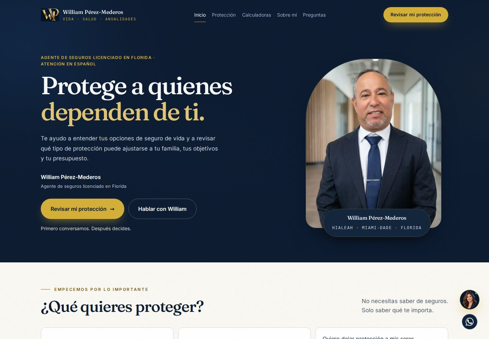
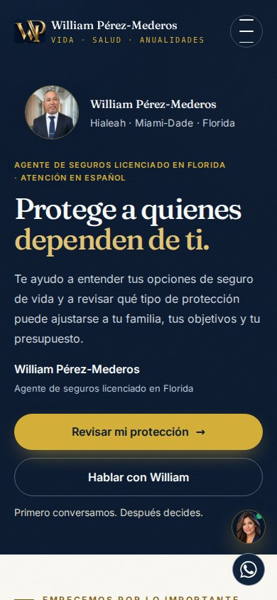
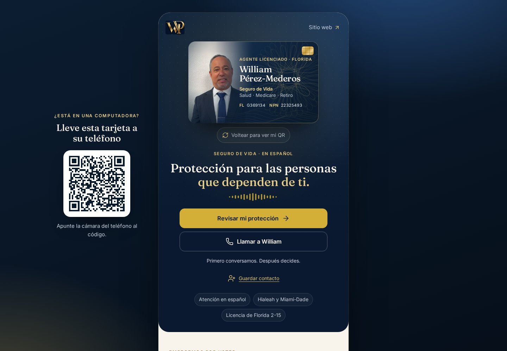
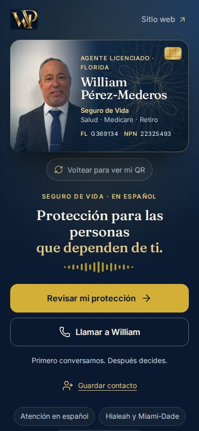

# William Pérez Seguros — Growth v1

Estado: rama preparada para revisión humana. **No desplegada. No fusionada a main.**

Base exacta: `vida-promocional-preparacion-20260926`, commit `347ff5e6ef5904b2266b6b2133536d84836a138e`.
Rama de entrega: `astra6-growth-v1-20260928`.
Referencia inspeccionada: `card-v2-premium-lead-engine`, commit `3b0a1ed0a5483c6fc052bcf9012d29bdd1dbb8f3`.

**Actualización posterior:** logo aprobado integrado y receptor de contactos implementado, aún sin activar. Ver [continuidad de marca y recepción](BRAND_AND_CONTACT_HANDOFF.md) para archivos, pruebas y pendientes actualizados.

## Qué se conserva y qué cambia

Se mantiene el proyecto HTML/CSS/JS original: rutas, imágenes WebP, fotografía real, mapa de Florida, pilares y sus diálogos, las cuatro calculadoras y su motor, preguntas frecuentes, biografía expandible, cierre con tarjeta 3D y asistente. No se instaló ninguna dependencia nueva en producción ni se sustituyó por una plantilla.

La tarjeta conserva fotografía, guilloché, navy/dorado, movimiento 3D, QR, descarga QR, vCard con foto, compartir, guía, dictado de cantidades, instalación y funcionamiento sin conexión. Se inspeccionó el tema Ocean Luminous de la referencia; se conservan las superficies claras y el contraste editorial sin importar sus archivos ni sustituir el navy actual. La base ya contiene una tarjeta posterior con lógica y recursos distintos.

- Portada: Vida como prioridad, mensaje y CTA solicitados, firma y atención en español.
- Autoidentificación: seis situaciones, explicación breve y contacto con el interés seleccionado; sin recomendar productos.
- Vida: ingresos, deudas, educación, gastos finales, legado y protección permanente, con lenguaje condicional.
- Método de William: cinco pasos, de escuchar a decidir sin presión.
- Captación: formulario común en portada, calculadoras y tarjeta. Nombre, contacto preferido, teléfono/email, código postal opcional, interés y horario; sin texto libre sensible. Solo el medio elegido es obligatorio.
- DIME: motor original conservado. Etiqueta educativa y CTA de revisión. La tarjeta no transmite cifras con el formulario.
- Tarjeta: CTA principal «Revisar mi protección» y secundario «Llamar a William». WhatsApp permanece como alternativa de contacto, sin campañas de aseguradora.
- Navegación: suave por defecto, cristal hacia calculadoras, rayo solo en la primera visita a Protección de la sesión. Movimiento reducido respetado.
- Privacidad/SEO: español, títulos y metadatos actualizados, Person e InsuranceAgency sin dirección residencial, nueva página de privacidad y sitemap actualizado. Tipografías locales reutilizadas.
- Medición: `wps:analytics` y `dataLayer`, sin proveedor ni token nuevo. Eventos de CTA, inicio/preparación/recepción de formulario, cálculo, compartir, guardar contacto e iniciar llamada. Las acciones de guardar/llamar miden el clic, no pueden certificar que el sistema operativo guardó el contacto o conectó una llamada.
- Limpieza: retirada agenda Calendly ficticia, datos de ejemplo y panel con PIN público que no protegía prospectos; permanecen en el historial Git. Se conservan las calculadoras públicas equivalentes. Retiradas estadísticas de terceros no necesarias para el recorrido, sin reemplazarlas por cifras nuevas. Corregidas afirmaciones de atención bilingüe y texto antiguo de ausencia de nombramientos.
- Asistente: bloque de voz comparado con la base, sin cambios. `asistente-arbol.js` y `cloudflare-worker.js` intactos. No se abrió una sesión de voz de pago ni se verificó su servicio remoto en esta fase.

## Recepción del formulario: limitación explícita

La base tenía `crmEndpoint: ""`. Abría WhatsApp y anunciaba éxito sin confirmar envío. No se inventó un receptor, una cuenta, una API key ni un servicio de correo.

En esta rama, con `leadEndpoint` vacío, «Solicitar conversación» prepara un mensaje en memoria y muestra **«todavía no se ha enviado»**. La persona debe abrir su correo y pulsar Enviar. No se emite `form_submitted` por preparar o abrir el correo.

La recepción automática sigue pendiente. Su contrato está listo en `assets/js/growth-config.js` y `growth.js`:

1. Elegir y configurar un receptor real autorizado, con validación del lado servidor, límites de solicitud, protección contra abuso y control de acceso a los prospectos.
2. Aceptar POST JSON; solo confirmar HTTP 2xx con `{ "accepted": true }` después de recepción/registro efectivo. Usar HTTPS y CORS restringido si es otro origen. Nunca colocar secretos en el JS público.
3. Configurar `leadEndpoint`, comprobar una entrega real autorizada y actualizar privacidad según el servicio utilizado.
4. Revisar retención, destinatario y operación de atención antes de producción.

Los tests usaron un receptor simulado exclusivamente local para éxito, fallo HTTP, respuesta sin confirmación y error de red. **No prueban entrega real a William.** No se enviaron mensajes de prueba a su correo o teléfono.

## Verificación realizada

- Chromium 153 headless: 7 rutas × 5 anchos (360, 390, 768, 1024 y 1440) = 35 vistas, sin desbordamiento horizontal, imágenes rotas o errores JS/HTTP detectados.
- Axe WCAG 2 A/AA y 2.1 AA: las siete rutas a 390 y 1440 px, sin infracciones detectadas tras corregir contrastes heredados. Esto no es una certificación completa de accesibilidad.
- Formulario: validación, consentimiento, preferencia email/teléfono, datos preservados al fallar, enlace correo y estado preparado sin falso éxito. Sin JavaScript, el envío queda desactivado para evitar poner datos en una URL GET; se ofrecen contacto telefónico/correo.
- DIME principal: ejemplo de la base produce $870,000; negativo rechazado. Las cuatro calculadoras cargan y calculan. DIME de tarjeta: $60,000 × 10 + supuesto heredado de $15,000 = $615,000; revisión lleva al contacto sin transmitir la cifra.
- Menú móvil/teclado/Escape, FAQs/tabs, biografía expandible, flip 3D, compartir/copia y vCard verificados.
- QR decodificado: destino canónico correcto de la tarjeta con etiquetas de origen/interés. No apunta a la rama ni a una preview; seguirá abriendo la versión publicada hasta un despliegue autorizado.
- Tarjeta offline: service worker registrado localmente para el test; assets Growth, tarjeta y DIME cargan sin conexión. No hay receptor offline.
- Transiciones realistas comprobadas: rayo primera vez, suave al repetir, cristal hacia calculadoras; capa se retira al terminar.
- Imágenes y fuentes sin nuevas llamadas externas en las 35 cargas locales. Sin nuevas librerías de producción.
- Inspección estática de referencias: sin archivos locales faltantes ni IDs duplicados en las páginas.
- Sin nombres/logos/productos de aseguradora añadidos, sin dirección residencial completa, sin tasas/promesas ni credenciales nuevas.

**Pendiente de QA:** Safari/WebKit y dispositivos físicos iPhone/iPad/Android. Se descargó WebKit, pero no pudo iniciarse por bibliotecas del sistema ausentes; la instalación de dependencias falló por permisos del entorno. Los tamaños móviles probados son emulación de viewport en Chromium, no pruebas en esos dispositivos. No se afirma compatibilidad Safari verificada ni métricas LCP/CLS de producción.

## Archivos de producto modificados o nuevos

| Archivo | Cambio |
|---|---|
| `index.html` | Hero Vida, autoidentificación, necesidades, método, formulario, SEO/schema y limpieza del panel demo |
| `assets/css/growth.css` (nuevo) | Capa visual aditiva, fuentes locales, responsive y accesibilidad |
| `assets/js/growth-config.js` (nuevo) | Configuración explícita del futuro receptor |
| `assets/js/growth.js` (nuevo) | Formulario, validación, recepción/handoff, intereses y eventos sin PII |
| `assets/js/sitio.js` | Retirada del formulario/panel antiguos, enlace al nuevo contacto, menú y medición; voz intacta |
| `assets/js/navegacion.js` | Nuevas anclas y rayo limitado por sesión |
| `calculadoras.html` | Formulario breve, DIME educativo, revisión de resultado y retirada agenda de ejemplo |
| `proteccion.html` | Coherencia de contacto, preguntas de necesidades en lugar de estadísticas |
| `sobre-mi.html` | Atención en español y corrección del texto antiguo de nombramientos |
| `preguntas.html` | Navegación, contacto, fuentes y contraste coherentes |
| `privacidad.html` (nuevo) | Descripción del tratamiento y las limitaciones de envío |
| `sitemap.xml` | Fechas y página de privacidad |
| `tarjeta/index.html` | CTA Vida, contacto breve, llamadas y textos de privacidad |
| `tarjeta/app.css` | Jerarquía comercial, acentos, móvil y formulario |
| `tarjeta/app.js` | Contacto, medición y validación DIME; QR/vCard/share conservados |
| `tarjeta/sw.js` | Nueva versión de caché y assets compartidos Growth |

`assets/css/sitio.css` y `assets/js/motor-calculadoras.js` no se modifican: se extienden y reutilizan.

Archivos de revisión añadidos: este informe, `GROWTH_V1_QA.json`, `GROWTH_V1_FINAL_CHECKS.json`, `growth-qa.cjs`, `growth-final-checks.cjs` y cuatro capturas en `review/screenshots/`.

## Capturas de la rama, no de producción

## Handoff y siguiente paso

No hay URL de preview desplegada. Las capturas documentan la rama local; producción permanece intacta. No existe aprobación de publicación implícita en este informe.

La revisión humana debe decidir la recepción automática y completar Safari/dispositivos antes de declarar Growth v1 listo para producción. Cualquier nuevo logo/activo aprobado debe coordinarse contra esta rama, leyendo el archivo original y conservando su identidad; no importar a ciegas otra tarjeta ni repetir la reconstrucción.
